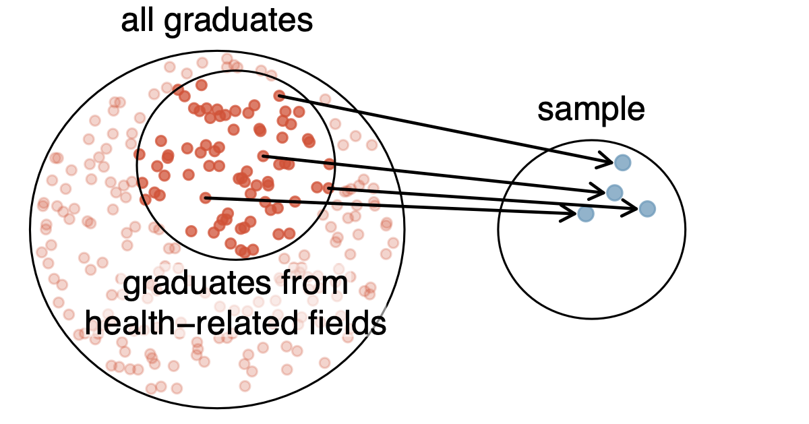
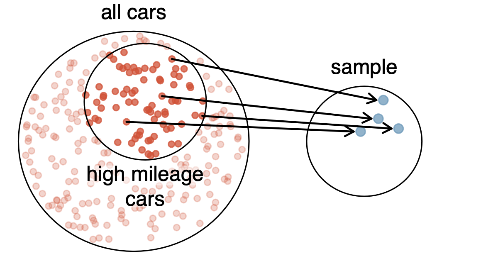
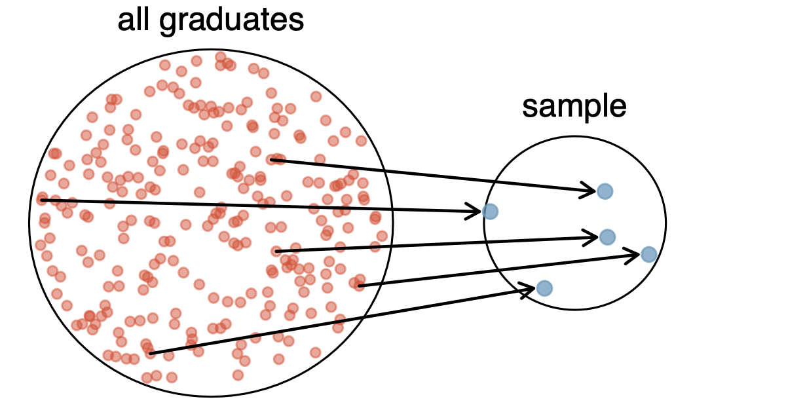
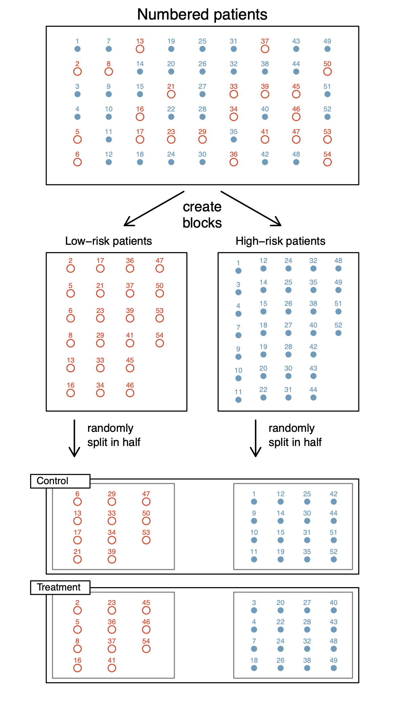

# Data Basics


## Data Set: `email`

Consider the `email` data set, found in OS4 Section 2.2 and in the R library
`openintro`.

```{r}
#| echo: false
#| output: asis
#| label: tbl-email
#| tbl-cap: "Four rows of data from the email data set"

suppressMessages(library(knitr))
suppressMessages(library(openintro))
data(email)
kable(email[c(1,2,3,50), c("spam", "num_char", "format", "number")])
```


## Data Set: `email`, organization

The data in @tbl-email represent a ~~**data matrix**~~ ~~**tibble**~~ **data
frame**, which is The way to organize data for statistical analysis.

Each row represents a new **observation**
(**individual** or **case**) and each column represents a new **variable**.

More observations are added to the data set by appending rows, and more
variables are added by appending columns.


## Data Set: `email`, words

@tbl-email displays rows 1, 2, 3, and 50 of a data set containing emails
received during early 2012.

It is important to know the units of each variable, and understand what each
variable means.

For example, the first row represents the first email of this data set, which is
not spam, contains 21,705 characters, was written in HTML format, and contains
only numbers larger than one million.


## Type of Variables

In @tbl-email, there are multiple types of variables.

* **Numerical** data is quantitative, e.g. it takes on numerical values and all
  mathematical operations $(+, -, *, /, <, >, =, ... )$ make sense with these
  values.

* **Categorical** data can be categorized, or placed into non-overlapping
  groups.  Possible values of a categorical variables are called levels.

## Types of Variables, sub-types of numerical

There are two general sub-types of numerical variables.

* **Continuous** data can take on any value within a specified range.

* **Discrete** data can take on only a countable number of values.


## Types of Variables, a combo

Another good to know, but less common, variable type is **ordinal**.

* **Ordinal** data can be considered a hybrid of numerical and categorical
  variables: it is a categorical variable but the levels have a natural
  ordering.


## Types of Variables, examples

* continuous: money, height, ...
* discrete: sides of dice, number of words in book, ...
* categorical: names of fertilizers, gender, ...
* ordinal: race positions, ...


## U.S. Counties

Use the words we just learned to explain the following table.

```{r}
#| echo: false
#| tbl-cap: "Sample of data from the county dataset."
#| label: tbl-county

data(county)
kable(county[sample(1:nrow(county), 6), c("state", "name", "pop2010", "median_edu")])
```


## Data Frames in R

Run these commands in R

```{r}
#| output: false
suppressMessages(library(openintro))
data(email) # load dataset email
str(email)  # ensure we're looking at a df
head(email) # top 6 rows; try tail
email$spam  # just one variable
names(email) # column names
some_cols <- c("spam", "num_char", "format", "number")
email[ , some_cols] # specified variables/columns
email[c(1,2,3,50), some_cols] # Table 1
```


# Data Collection

## Population

* A **population** is the complete set of observatons of interest.

* It is often too difficult to survey an entire popluation of interest:

    * prohibitively expensive

    * physically impossible or nearly so

    * too time consuming

    * ...


## Identifying the Population

To which **population** do the following research questions refer?

* What is the average mercury content in swordfish?

* Over the last 5 years, what is the average time to complete a degree for Chico
  State undergraduate students?

* Does a new drug reduce the number of deaths in patients with severe heart
  disease?


## Population Out of Reach

A **sample** represents a subset of the cases and is often a small fraction of
the population.  For instance, 60 swordfish in the population might be selected.
Statistics based on this sample provide estimates (best guesses) about the
population.


## Sampling From a Population, good

In general, we always seek to randomly select a sample from a population.  How
might we do this?


## Sampling From a Population, bad

**Bias** occurs in samples that over/under represent specific sub-groups of the
population.  We seek to avoid bias in our samples.




## The Most Common Forms of Bias

Consider the following anecdotes.

* A man on the news got mercury poisoning from eating a swordfish, so the
  average mercury concentration in swordfish must be dangerously high.

* I met two students who took more than 7 years to graduate from Chico State, so
  it must take longer to graduate at Chico State than at many other colleges.

* My friend's dad had a heart attack and died after they gave him a new heart
  disease drug, so the drug must not work.

* In February 2010, some media pundits cited one large snow storm as valid
  evidence against global warming, so climate change is obviously fake.


## Avoid Anecdotal Evidence

Anecdotal evidence typically is composed of unusual cases that stand out in our
memory.  For instance, we are more likely to remember two people we met who took
7 years to graduate, than the six others who graduated in four years.  Instead
of looking at the most unusual cases, we should examine a sample of many cases
that represent the population.


## Another Example of Bias

Say we are interested in estimating the average gas mileage of all cars.




## Origins of Bias

Bias can come from a number of different places:

* **Convenience Sampling** occurs when a sample is chosen based on ease of
  access to the individuals.  Examples?

* **Non-response** occurs when some respondents refuse to answer survey
  questions. Examples?

* **Self-selection** occurs when some individuals of a study eagerly participate
  while others are generally uninterested.  Examples?

* **Exclusion** occurs when a sub-group of the population is generally
  unreachable.  Examples?

* ...


## Proper Ways to Sample

* **sample with replacement**. Draw members from the population one at a time such
 that each member has equal probability of being selected, returning the
 selected member to the population for the next draw.  If any member is selected
 more than once, put that selection back and select again.  Repeat the process
 until you have a sample of the desired size.

* **sampling without replacement**. Draw members from the population one at a
  time such that each member has equal probability of being selected at each
  draw.  Repeat the process until you have a sample of the desired size.


## Using a Computer to Sample, Homework 02

Sampling in R[^1] with or without replcement is easy.

```{r}
#| echo: true
x <- c("Diego", "Andrea", "Sargentini", "Chewbaca", "Fido")
sample(x, 3) # without replacement
sample(x, 7, replace=TRUE)
```

[^1]: Come back to this slide for Homework 02.


## Statistics in General



:::: {.columns}

::: {.column width="40%"}
Population: characteristics called **parameters**
:::

::: {.column width="40%"}
Sample: characteristics called **statistics**
:::

::::

Characteristics of both can be numeric, categorical, $\ldots$


# Studies

## Observational and Experimental Studies

There are two primary types of data collection: observational studies and
experiments.

* **observational study**. The researcher simply monitors and collects data on
  things as they are, by observing.  There is no manipulation of the study by
  the researcher.

* **experiment**.  The researcher assigns the value of the
  explanatory/independent variable for each unit. In other words, the researcher
  controls which subjects go into which treatment groups.


## Experimental Studies, examples

Experimental studies, through the direct manipulation from the researcher, can
provide cause-and-effect relationships between the response/dependent and
explanatory/independent variable.


* (insert context) ... researchers collect a sample of individuals and split
them into groups.  The individuals in each group *assign* a treatment, one group
per level of the explanatory/independent variable.

* To study the effect of tar contained in cigarettes researchers painted
tobacco tar on the back of some mice but not others, and recorded if the painted
mice had cancer at a higher rate than those not exposed to the tar TODO add
cition Wynder:1953


## Observational and Experimental Studies, identify

For each of the following situations, identify if it is an observational study
or an experiment.

* Review medical or company records to attempt to identify fraud.

* Follow a group of many similar individuals to study why certain diseases might
  develop.

* Plant a specific type of native grass in select areas to see if the native
  species will out-compete an invasive species.


## Independent/Explanatory and Dependent/Response Variables

In studying the relationship between two variables, the variables are often
viewed as either a **response/dependent variable** or an
**explanatory/idependent variable**.

To identify the explanatory variable in a pair of variables, ask yourself which
of the two explains the other.  Often, many variables will explain/predict the
response/dependent variable.


## Explanatory and Response Variables

* **response/dependent variable**. The response/dependent variable is the
  variable or characteristic of the data that we are wanting to learn about (to
  explain, to predict, or to estimate), or that depends on other variables.

* **explanatory/independent variable**.  The explanatory/independent variable is
  the variable that does the explaining, or whose effect on the response
  variables is of interest.


## Explanatory and Response, examples

Identify the explanatory/independent and response/dependent variables from the
following.

* fertilizer and growth
* college grade point average and high school grade point average
* average federal spending and counties with high rates of poverty
* police department budget and crime rate
* ...


## Explanatory/independent and Response, caution

Labeling variables as explanatory/independent and response/dependent does not
guarantee the relationship between the two is actually causal, even if there is
an association identified between the two variables.  We use these labels only
to keep track of which variable we suspect affects the other.

```{mermaid}
%%| echo: false

flowchart LR
    A(Explanatory variables ) -- might affect --> B(Response variable )
```


## Confounding Variables

Suppose an observational study tracked sunscreen use and skin cancer, and it was
found that the more sunscreen someone used, the more likely the person was to
have skin cancer. Does this mean sunscreen *causes* skin cancer?  Or is
there another variable we aren't accounting for?

```{mermaid}
%%| echo: false

flowchart LR
    A(sun exposure) --> B(skin cancer)
    A --> C(use sunscreen)
    C -- ? --> B
```


# Experimental Design


## Stents Study

TODO cite this Chimowitz:2011 collected data on 451 at-risk patients.  Two time
points were measured 30 days after enrollment and 365 days after enrollment.

Each volunteer patient was randomly assigned to one of two groups:

**Treatment group** 224 patients in the treatment group received a stent and
  medical management.

**Control group** 227 patients in the control group received the same medical
management as the treatment group, but they did not receive stents.


## Experiments

Studies where the researchers assign treatments to cases are called experiments.

When this assignment includes randomization, e.g.\ using a coin flip to decide
which treatment a patient receives, it is called a **randomized experiment**.
Randomized experiments are fundamentally important when trying to show a *causal*
connection between two variables.


## Stents Study, data

OS 4 Case study 1.1. Of the 224 patients in the treatment group, 45 had a stroke
by the end of the first year.  Using these two numbers, compute the proportion
of patients in the treatment group who had a stroke by the end of their first
year.  Compute the proportion of patients in the control group who had a stroke
by the end of their first year.

<table>
  <tr>
    <td></td>
    <th scope="col">stroke</th>
    <th scope="col">no event</th>
  </tr>
  <tr>
    <th scope="row">treatment</th>
    <td>45</td>
    <td>179</td>
  </tr>
    <tr>
    <th scope="row">control</th>
    <td>28</td>
    <td>199</td>
  </tr>
</table>


## Stents Study, R is a calculator

We do the calculations in R.

```{r}
45 / (45+179)   # treatment, had stroke
28 / (28 + 199) # control, had stroke
```


## Stents Study, careful with conclusions

Our findings are a bit surprising, and since this is a randomized experiment we
may be ready to draw causal connections, but don't!


* Did you happen to see the words "volunteer patient"?

* Are there other reasons, **confounding variables**, that might explain
  these findings?

* Does our sample generalize to all stroke patients?

* ...


## Experiments, principles

To better ensure proper randomized experiments, there are some basic principles
that all experiments aim to perfect.

* **Control**. Researchers assign treatments to cases (or experimental units),
  and they do their best to control any other differences in the groups.

* **Randomization**. Researchers randomize patients into treatment groups to
  account for variables that cannot be controlled.

* **Replication**. The more cases researchers observe, the more accurately they
  can estimate the effect of the explanatory/independent variable(s) on the
  response/dependent variable.

* **Measurement error**. Science is beyond the easy to measure.  Exact
  measurements are not always available, instead assumptions/guesses/best
  efforsts are often made.


## Experiments, control

Examples of control in experiments.

* When patients take a drug in pill form, some patients take the pill with only
  a sip of water while others may have it with an entire glass of water. To
  control for the effect of water consumption, a doctor may ask all patients to
  drink a 12 ounce glass of water with the pill.

* Researchers assigning levels of certain fertilizers.

* ...


## Experiments, randomization

Examples of randomization in experiments.

* Some patients may be more susceptible to a disease than others due to their
  dietary habits.  Randomizing patients into the treatment or control group
  helps even out such differences, and it also prevents accidental bias from
  entering the study.

* Order of foods/drinks eaten in taste tests.

* ...


## Experiments, replication

Examples of replication in experiments.

* In a single study, we replicate by collecting a sufficiently large sample.

* Ask multiple people to taste test a food/drink.

* ...


## Experiments, measurement error

Example of measurement error.

* Counting salmon populations in the Sacramento River.

* Measuring unemployment at the census tract, county, state, nation.

* yada yada yada physics.

* ...


## Identify Basic Principles, Rats

To study the effect of tar contained in cigarettes, TODO cite Wynder:1953 painted
tobacco tar on the back of some mice but not others, and recorded if the painted
mice had cancer at a higher rate than those not exposed to the tar.


## Experiments, blocking can help

Researchers sometimes know or suspect that variables, other than the treatment,
influence the response.  Under these circumstances, they may first group
individuals based on this variable into blocks and then randomize cases
within each block to the treatment groups.

* **Blocking**. The grouping of similar individuals.  They are grouped into
  blocks.


## Experiments, blocking can help picture

::: {#fig-blocking}

:::

## Experiments, blocking example

@fig-blocking shows blocking using a variable depicting patient risk.  Patients
are first divided into low-risk and high-risk blocks, then each block is evenly
separated into the treatment groups using randomization.  This strategy ensures
an equal representation of patients in each treatment group from both the
low-risk and high-risk categories.


## Experiments, specific keywords

Time to clear up some commonly used keywords that are specific to experiments.

* **Treatment**. A specific experimental condition applied to each case.

* **Levels**. Unique set of values that the Treatment (or any categorical
  variable) takes on.

* **Experimental Units**. The observation/case/subject to which a treatment is
  applied.


## Experiments, specific keywords by example

Consider the dataset `ChickWeight` by TODO cite Crowder:1990.

```{r}
#| echo: false
#| tbl-cap: "8 randomly chosen rows of ChickWeight dataset."
#| label: tbl-chickweight

suppressMessages(library(dplyr))
kable(sample_n(select(filter(ChickWeight, Time==06), -Time), 8))
```


## Experiments, already? known keywords

And let's just be clear about a few other keywords.

* **Placebo**. A fake treatment.

* **Blind**. When researchers keep their patients uninformed about their treatment.

* **Double Blind**. When both researchers and patients do not know which patient
  receives which treatment.


## Experiments, homework 02

A researcher is conducting an experiment to see the effect of diet and exercise
on weight gain in baby hamsters.  Two different diets (low fat and high fat) and
three different levels of exercise (high, moderate, or none) will be used.
Eight baby hamsters will be raised under each combination of diet and exercise
and their weight gain after 4 weeks will be measured.

::: {.nonincremental}
* What are the experimental units here?
* What are the categorical variables? List the levels of each.
* How many different treatments are there? List them.
* How many experimental units will this experiment require?
:::
