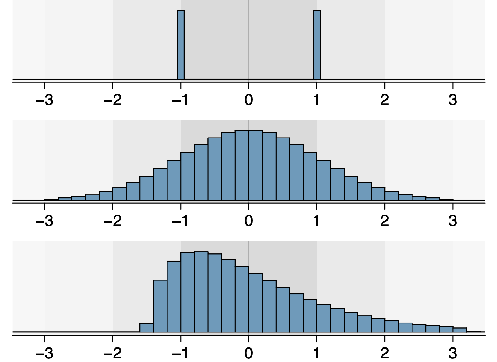
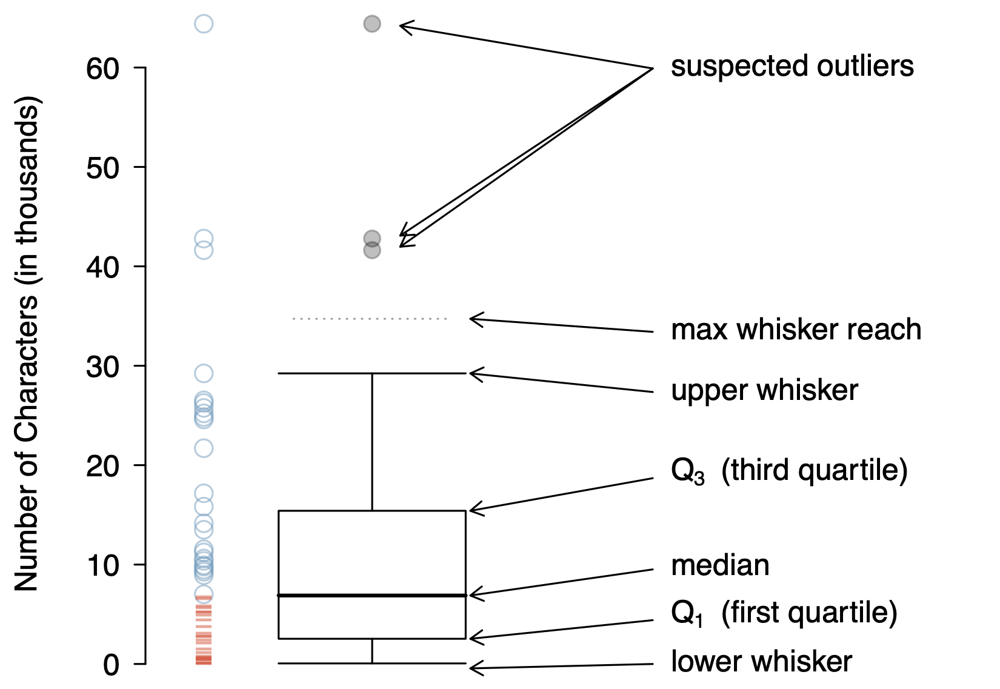

# Categorical Data


## Visualizing Categorical Variables

With categorial data we can make **bar charts**.


```{r}
suppressMessages(library(tidyverse))
suppressMessages(library(openintro))
data(email)
ggplot(data = email, aes(number)) +
    geom_bar() +
    labs(title = "email 'Number' Frequency")
```

## `county`

Recall the county data set? How big?

```{r}
data(county)
tail(county[, c("state", "name")])
```


## `county`

Frequency table of county data.

```{r}
table(county$state)
```

## `county`

Bar chart of county data.

```{r}
(pl <- ggplot(data = county, aes(state)) +
     geom_bar() +
     labs(title = "?", x = "States"))
```


## `county`

```{r}
pl + theme(axis.text.x = element_text(angle = 45,
    hjust=1))
```


# Numerical Data

## Towards Histograms

What do we give up by finding a mean? Consider `county`

```{r}
mean(county$per_capita_income, na.rm = TRUE)
min(county$per_capita_income, na.rm = TRUE)
max(county$per_capita_income, na.rm = TRUE)
```


## Histograms

A histogram helps summarize tails of the data:

```{r}
(p <- ggplot(data = county, aes(per_capita_income)) +
     geom_histogram(bins = 21) +
     labs(x = "Per capita income"))
```


## Histograms, in words


Think of each observation as belonging to a **bin**.  These binned observations
are plotted as bars to form a histogram.  That is, the height of each bar
depicts the number of observations within each bin.

* The `county$per_capita_income` data has data from $10,466.84 up to
  $69,532.86.  Setting `binwidth = 1800` creates bins of width 1,800
  and places the appropriate observations in each.  Observations on
  the boundary of a bin are allocated to the lower bin.


## Histograms, picking bins

Since the researcher has to choose the bin width, we should learn the
difference between bins that are too small and bins that are too wide.


## Histograms, too many

Extremely small bins

```{r}
ggplot(data = county, aes(per_capita_income)) +
    geom_histogram(binwidth = 3) +
    labs(x = "Per capita income")
```


## Histograms, too few

Extremely large bins

```{r}
ggplot(data = county, aes(per_capita_income)) +
    geom_histogram(binwidth = 80000) +
    labs(x = "Per capita income")
```


## Histograms, by group

Compare chicken weights by diet.

```{r}
ggplot(data=ChickWeight, aes(weight)) +
    geom_histogram(bins = 21) +
    facet_wrap(Diet ~ ., ncol = 1)
```


## Histograms, keywords

* **right skewed**. When data trail to the right and have a longer right tail,
  the shape is said to be right skewed.

* **left skewed**. Data with the reverse characteristic -- a long, thin
  tail to the left -- are said to be left skewed.

* **symmetric**. Data that show roughly equal tails in both directions are
  called symmetric.


## Histograms, and measures of center

Where is the mean on a histogram?  Median?

```{r}
mn <- mean(county$per_capita_income, na.rm = TRUE)
mdn <- median(county$per_capita_income, na.rm = TRUE)
p + geom_vline(aes(xintercept=mn), color="red", size=1) +
    geom_vline(aes(xintercept=mdn), color="blue", size=1)
```


## Histograms, they tell us more

What more, other than the center of the data, do histograms tell us? Consider a
histogram from the `email` data set.


```{r}
em <- mean(email$num_char)
ggplot(data=email, aes(num_char)) +
    geom_histogram(bins = 21) +
    geom_vline(aes(xintercept = em), color = "blue")
```


## Histograms, an ideal

```{r}
#| echo: false

df <- data.frame(x = rnorm(1001))
(p <- ggplot(data = df, aes(x)) +
    geom_histogram(bins = 21))
```

## Data Width, 1 standard deviation

Histograms naturally connect with **standard deviations**.  If the data are
**unimodal** (ish) and symmetric (ish), roughly 68% of the data will be within
one standard deviation of the mean.


```{r}
#| echo: false
p + geom_vline(xintercept=c(-1,1),
               color=c("blue", "blue"))
```


## Data Width, 2 standard deviations

If the data are **unimodal** (ish) and symmetric (ish), roughly 95% of the data
will be within two standard deviations of the mean.


```{r}
#| echo: false
p + geom_vline(xintercept=c(-2, 2),
               color=c("blue", "blue"))
```

## Data Width, 3 standard deviations

If the data are **unimodal** (ish) and symmetric (ish), roughly 99.7% of the data
will be within three standard deviations of the mean.


```{r}
#| echo: false
p + geom_vline(xintercept=c(-3, 3),
               color=c("blue", "blue"))
```


## Standard Deviations, be careful

Three different population distributions with the same (population) mean
$\mu$ = 0 and (population) standard deviation $\sigma = 1$.


{fig-align="center"}


## Towards Box plots

We will use the data set `carnivora` found within the library `ape`.

```{r}
library(ape)
data(carnivora)
# ?carnivora
```


## recap: summary statistics

R will fairly easily produce six number summaries for us.  Here's the
variable for average brain weight amongst male and female animals from
the order Carnivora.

```{r}
summary(carnivora$SB)
```


## Box Plots

A **box plot** summarizes a data set using five (standard) statistics
while also plotting unusual observations.


## Box Plot, explained

{fig-align="center"}


## Box Plot, carnivora example

```{r}
ggplot(data = carnivora, aes(Order, SB)) +
    geom_boxplot() +
    labs(y = "Average brain weight (g)",
         x = "Order")
```

## Box Plot, better carnivora example

Have you seen some of the families in carnivora? From adorable,
[Ailuridae](https://en.wikipedia.org/wiki/Ailuridae), to huge,
[Ursidae](https://en.wikipedia.org/wiki/Bear).


```{r}
ggplot(data = carnivora, aes(Family, SB)) +
    geom_boxplot() +
    labs(x = "Family", y = "Average brain weight (g)")
```


## Towards scatter plots

The most common bivariate plot is the **scatter plot**.

A scatterplot provides a case-by-case view of data for two numerical
variables.


## Scatterplot, `carnivora` example

```{r}
ggplot(data = carnivora, aes(SW, SB)) +
    geom_point() +
    labs(x = "Average body weight (kg)",
         y = "Average brain weight (g)")

```

## Scatter plots, keywords

* **associated**. When two variables show some connection with one
  another, they are called associated variables.


* **independent**. If two variables are not associated, then they are
  said to be independent.


## Scatter plots, keywords

Direction of association can be described as

* **positive association**. When two variables have an upward/positive
  trend, they are called positively associated.

* **negative association**. When two variables have a
  downward/negative trend, they are called negatively associated.

## Scatter plots, keywords

Structure of association can be described as **linear** or
**non-linear**.


## Scatter plot, `Indometh` example

```{r}
library(datasets)
# ?Indometh
ggplot(data = Indometh, aes(time, conc)) +
    geom_point()
```


## Scatter plot, `CO2` example

```{r}
# ?CO2
ggplot(data = CO2, aes(conc, uptake, colour = Type)) +
    geom_point()
```


## Scatter plots, careful

```{r}
# x: Australian residents, quarterly 03/1971 - 03/1994
# y: WI beaver body temps, 10 min intervals
df <- data.frame(x = as.vector(austres),
                 y = beaver1[1:length(austres), "temp"])
ggplot(data = df, aes(x, y)) +
    geom_point()
```


## for fun


<https://xkcd.com/552/>


## Take Away

* categorical variable -> bar chart
* one numerical variable -> histogram
* one numerical and one categorical -> box plot
* two numerical -> scatter plot
* ... many variations
