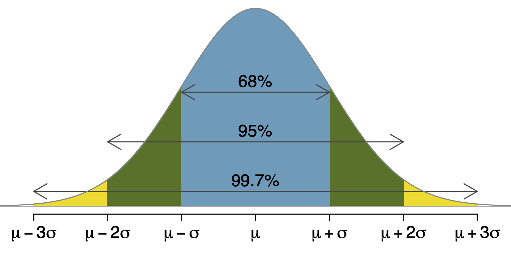

```{r}
#| include: false
library(ggplot2)

theme_set(
    theme_minimal(base_size = 16)
)
update_geom_defaults("line", list(size = 1.1))
```


# Recap

## recap: best guesses

Sample statistics are best guesses about characterstics of the population; we
estiamte unknown population parameters with sample statistics, respectively.


| Population Parameter | Sample Statistic |
|----------------------|------------------|
| $\mu$ | $\bar{x}$ |
| $\sigma, s$ | $\hat{\sigma}, \hat{s}$ |
| $\sigma^2, v$ | $\hat{\sigma}^2, \hat{v}$ |
| $p$ | $\hat{p}$ |
| ... | ... |


# Motivating Distributions

## Distributions, proportions from histogram

We can use a sample (visualized as a histogram) to estimate the proportion of
people

* between 180 and 190cm tall, or
* taller than 220cm,
* shorter than 201cm.


```{r}
#| echo: false
suppressMessages(library(tidyverse))
h <- rnorm(1e5, 190, 10)
df <- data.frame(h = h, b = 180 < h & h < 190, l = h < 201, g = h > 220)
```


## Distributions, proprotions from histogram

Proportion of sample between 180 and 190cm tall?

$\frac{\text{# people between 180 and 190}}{n} =$ `r (Fhatb = round(mean(df[,"b"]), 4))`

```{r}
#| echo: false
ggplot(data = df, aes(x = h, fill = b)) +
    geom_histogram(binwidth = 1, colour = "black") +
    labs(x="height (cm)", y="") +
    theme(axis.text.y = element_blank(),
          axis.ticks = element_blank()) +
    scale_fill_manual(values = c("white", "black"), guide = FALSE)
```


## Distributions, connecting to histograms

We are still estimating things about the popluation.  Now we are estimating
proportions between two numbers, instead of where the distribution is centered
($\mu$) or how wide the distribution is ($\sigma$).


# Distributions

## Distributions, in simple language

Distributions are the population analogue to histograms, just as $\mu$ is the
population analogue to $\bar{X}$.  Distributions are mathematical descriptions
of populations, defined by a function that has a measure of center $\mu$ and a
measure of spread $\sigma$.


## Distributions, an example

We often model adult male heights with a **continuous
distribution**. Simplified, this means we draw a curve over a histogram with
decreasing binwidths of an infinite set heights.


## Distributions, an example

```{r}
#| echo: false

p <- ggplot(data = df, aes(x = h))
p + geom_histogram(aes(y=..density..), binwidth=2, fill="white", colour="black") +
    labs(x="height (cm)", y="") +
    theme(axis.text.y=element_blank(),
          axis.ticks=element_blank())
```


## Distributions, an example

```{r}
#| echo: false

p + geom_histogram(aes(y=..density..), binwidth=1, fill="white", colour="black") +
    labs(x="height (cm)", y="") +
    theme(axis.text.y=element_blank(),
          axis.ticks=element_blank())
```

## Distributions, an example

```{r}
#| echo: false

p + geom_histogram(aes(y=..density..), binwidth=0.5, fill="white", colour="black") +
    labs(x="height (cm)", y="") +
    theme(axis.text.y=element_blank(),
          axis.ticks=element_blank())
```

## Distributions, an example

Without a sample, we hypothesize the (population) distribution of heights to
have a nice mathematical form.

```{r}
#| echo: false

p <- ggplot(data = data.frame(x=range(h)), aes(x)) +
    stat_function(fun = dnorm, geom = "line", args = list(mean=190, sd=10)) +
    labs(x="height (cm)", y="") +
    theme(axis.text.y=element_blank(),
          axis.ticks=element_blank())
p
```


## Continuous Distribution

This smooth curve represents a **probability density function** (also called a
**density** or **distribution**).  The toal area under the density function is
equal to 1.


## Distributions, probability

What is the probability that a randomly selected adult is between 180 and
190cm tall?

$P(180 < X < 190) =$ `r (Fb = round(pnorm(190, 190, 10) - pnorm(180, 190, 10), 4))`

```{r}
#| echo: false

d <- ggplot_build(p)$data[[1]]
p + geom_area(data=subset(d, 180 < x & x < 190), aes(x=x, y=y),
              fill="black", colour="black") +
    labs(x="height (cm)", y="") +
    theme(axis.text.y=element_blank(),
          axis.ticks=element_blank())
```


## Distributions, sample estimates population

The proportion of people within the sample in between 180cm and 190cm
`r Fhatb` is a close estimate of the population probability that a
randomly chosen person is between those same heights `r Fb`.


## Distributions, proprotions from histogram

Proportion of sample less than 201?

$\frac{\# \text{people} < 201}{n} =$ `r (Fhatl = round(mean(df[,"l"]), 4))`

```{r}
#| echo: false

ggplot(data=df, aes(x=h, fill=l)) + geom_histogram(binwidth=1, colour="black") +
    labs(x="height (cm)", y="") +
    theme(axis.text.y=element_blank(),
          axis.ticks=element_blank()) +
    scale_fill_manual(values = c("white", "black"), guide=FALSE)
```


## Distributions, probability

What is the probability that a randomly selected adult is shorter than 201?

$P(X < 201) =$ `r (Fl = round(pnorm(201, 190, 10), 3))`

```{r}
#| echo: false

p + geom_area(data=subset(d, x<201), aes(x=x, y=y), fill="black", colour="black") +
    labs(x="height (cm)", y="") +
    theme(axis.text.y=element_blank(),
          axis.ticks=element_blank())
```


## Distributions, sample estimates population

Again, the proportion of people within the sample that are shorter than 201cm
`r Fhatl` is a close estimate of the population probability that a
randomly chosen person is shorter than $201$cm `r Fl`.


## Distributions, population known?

Though, there is something odd going on.  We've assumed we know the population
distribution; it's shape, it's mean, and it's standard deviation.


## Distributions, in practice

In practice, we don't and won't know the population distribution.  Nevertheless,
we can learn things about it via a sample.  Soon we'll find out that this lack
of knowledge about the population, really just doesn't matter.


# Random Variables

## Random Variables, an example


Continuing our height example: in the case of randomly selected individuals and
their height, the random variable $X$ is the height of an unknown (to be
randomly selected) individual.


## Random Variables, an example

In this example, the random variable is an adult's height.  Since we don't yet
know how tall a to be randomly selected adult is, we denote the to be determined
value by $X$.  Once we observe the variable's outcome, we write the value of the
adult as $x$.


## Random Variables, definition

A random process or variable with a numerical outcome, see OS4 Section 3.4.1.


## Random Variables, note

Each random variable has a distribution function that describes the form of the
random variable.  Tying the pieces together, we say that each random variable
(via its distribution function) has a measure of center $\mu$ and a measure of
spread $\sigma$.


## Uniform Distribution

The discrete uniform distribution is the simplest of discrete distributions.  We
write $X \sim U(a, b)$, meaning the random variable $X$ is distributed uniformly
on the interval $[a, b]$.


## Uniform Distribution, example

The canonical example is die rolling.  If we let the random process of die
rolling be denoted by $X$, then $X \sim U(1, 6)$.


## Bernoulli Distribution, motivation I

Suppose you work for the IRS and you are interested in the probability that a
randomly selected tax payer is attempting to commit fraud on their tax
return.  So you and your boss decide to test this.  From a sample of 900 tax
payers, you perform an in deep search through each of the 900 tax forms.


## Bernoulli Distribution, motivation II

Suppose you want to know the frequency of a dominant gene, say A, in a
population[^1]. You draw 50 members of the population at random
and find that 12 of them display the dominant phenotype.

[^1]: We assume that the population is sufficiently large that
removing 50 individuals is without effect and that the population is in
Hardy-Weinberg equilibrium.


## Bernoulli Distribution, motivation III

You are interested in calculating the average G/C fraction of Human genomic DNA
across the whole genome.  You sample $50$ individuals, sequence their genome
...


## Bernoulli Distribution, introduction

Notice what is common to all of these scenarios


* random variable has just two outcomes: "success" or "failure"
    * commit fraud or not, dominant or not, G/C base or not

* independent trials

    * your not paying taxes does not (necessarily) determine your neighbor's
    willingness to pay taxes, ..., G/C base here does not dictate next base

* probability of "success," $p$, stays the same
    * Bill through Ted have 0.62% chance of commiting fraud, ..., dominant gene
      A shows with frequency of 0.1


## Bernoulli Distribution, more formally

The Bernoulli distribution describes the probability of seeing a successes,
calculated from $n$ independent trials with probability of a success $p$.


## Bernoulli Distribution, conditions met?

Let's discuss: suppose you work for the IRS and you are interested in the
probability that a randomly selected tax payer is attempting to commit fraud on
their tax return.  So you and your boss decide to test this.  From a sample of
900 tax payers, you perform an in depth search through each of the 900 tax
forms.


## Binomial Distribution

If we can estimate $p$ from a sample of Bernoulli random variables, we can then
answer questions of the sort

* What is the probability that 3 of the next 9 tax forms are found to be fradulent?
* What is the probability that 20 of 50 randomly sampled individuals will display
  the dominant phenotype?
* ...


## Binomial Distribution

```{r}
#| echo: false

ggplot(data.frame(x = 0:51), aes(x, dbinom(x, 50, 0.2))) +
  geom_point() +
  labs(x="", y="") +
    theme(axis.text.y=element_blank(),
          axis.ticks=element_blank())
```

## Normal Distribution

The **normal distribution** is ubiquitous in statistics.

```{r}
#| echo: false

ggplot(data.frame(x=c(-4,4)), aes(x)) + stat_function(fun=dnorm, geom="line") +
    labs(x="", y="") +
    theme(axis.text.y=element_blank(),
          axis.ticks=element_blank())
```


## Normal Distribution

The **normal distribution** is a probability density function that is symmetric,
unimodal, and bell shaped.

Notes

* area under the curve is equal to 1,
* perfectly symmetric about $\mu$,
* parameters: centered at $\mu$ with standard deviation $\sigma$,
* often $\mu = 0$, shifts the distribution,
* often $\sigma = 1$, scales the distribution,
* we write in short hand $N(\mu, \sigma)$,
* use $Z$ to denote $N(0,1)$
* [Gau$\beta$ian distribution](https://en.wikipedia.org/wiki/Carl_Friedrich_Gauss)


## Interlude, z-score

The z-score of an observation is the number of standard deviations the
observation lies above or below the mean.  We compute the z-score for an
observation $x$ that follows a distribution with mean $\mu$ and standard
deviation $\sigma$ using $$z = \frac{x - \mu}{\sigma}$$


## z-score notes

* The Z-score is a unitless number.  Why?
* By definition, if an observation is 1 standard deviation above its mean, the
  z-score is 1.  If an observation is 1.5 standard deviations below the
  mean, its z-score is -1.5.


## Z-score, example

* Suppose SAT scores are distributed $X \sim N(1500, 300)$ and ACT scores are
  distributed $N(21, 5)$.  If Ann scored 1800 on the SAT and Tom scored 24
  on the ACT, who performed better?

* $z_A = \frac{1800 - 1500}{300} =$ `r (1800 - 1500) / 300`
* $z_T = \frac{24 - 21}{5} =$ `r (24 - 21) / 5`

* These are effectively quantiles/percentiles.  Picture?


## 68, 95, 99.7 Rule

Use R to justify the following approximate numbers.





# Parameters

## Random Variables, expected value

All random variables have a theoretical mean, called the **expected value**.
The sample mean $\bar{X}$ is the sample analogue of this quantity.

* The expected value of $X$, written $\mu = E(X)$, is the value we'd expect to
  get out of $X$ is we infinitely repeated the process that generated $X$ and
  calculated the mean.


## Random Variables, expected value example

Let $Y$ take on the values $0,1$ with equal probability -- think coin flip.  We
can use R to simulate this random variable.  We generate a sequence
$y_1, y_2, ..., y_{10000}$, each of which will be $0$ or $1$ once observed,
and calculate the running mean.  That is,


* $Y_1$ evaluates to $y_1$, with mean $y_1 / 1$
* $Y_1, Y_2$ evaluate to $y_1, y_2$, with mean $(y_1 + y_2)/2$
* $Y_1, Y_2, Y_3$ evaluate to $y_1, y_2, y_3$, with mean $(y_1 + y_2 + y_3)/3$
* ...
* $Y_1, ..., Y_{10000}$ evaluate to $y_1, ..., y_{10000}$, with mean $\sum_{i=1}^{10000} y_i /10000$.


----

Since we expect the long-run average of a coin flip to be $1/2$, our running
mean should converge to $1/2$.

```{r}
#| echo: false

N <- 1e4
x <- rbinom(N, 1, 0.5)
n <- 1:N
df <- data.frame(x = n, p = cumsum(x) / n)
ggplot(data = df, aes(x, p)) +
    geom_line() +
    geom_hline(yintercept = 0.5, linetype = "dashed") +
    labs(y = "Probability of flipping heads", x = "Flip")

```


## Random Variables, variance

Random variables also have a common measure of spread, called the
**variance**.  The squared sample standard deviation, $s^2$, is the sample
analogue of this quantity.

* The variance of $X$, written $\sigma^2 = Var(X)$, is the mean of squared
  deviations about $E(X)$ if we infinitely repeated the process that generated
  $X$.


## Random Variables, variance example

Consider $Y$ a random variable following a Bernoulli distribution with
probability of "success" $p$.

```{r}
#| echo: false
x <- seq(0, 1, length.out = 101)
df <- data.frame(x = x, v = x * (1 - x))
ggplot(data = df, aes(x, v)) +
    geom_line() +
    labs(x = "p", y = "Variance")
```


## Random Variables, distributions

Random variables are said to follow specific distribution functions, eg $X$ is
distributed as [some name].

We calculate the expected value and variance of random variables from these
distribution functions.  When we calculate statistics, it is these mathematical
quantities that we are estimating.


## Take Away

* We assume distributions describe populations of interest
    * distributions describe the shape of our data
* Distributions have parameters: mean, variance, percentiles, ...
* Use data to estimate parameters
    * use data to learn about population
