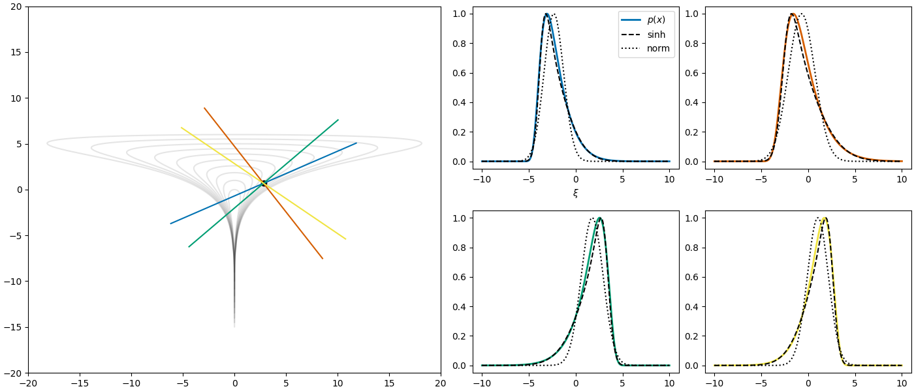
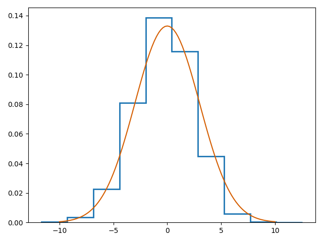
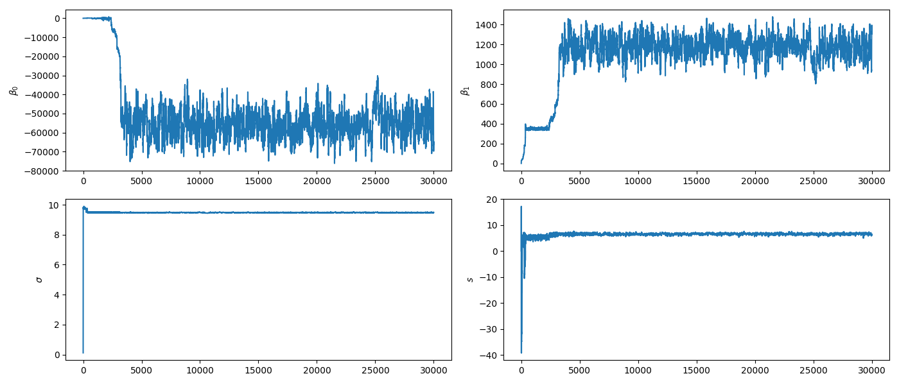
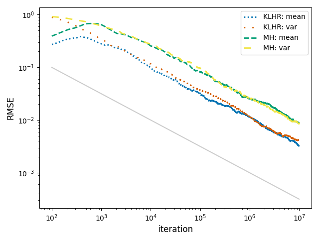
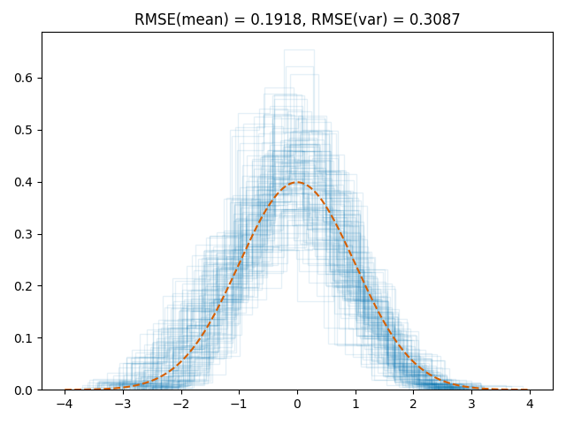

## Metropolis-Hastings

$$
\begin{align}
\theta^* & \sim \text{Normal}(\theta^{(m)}, \Sigma)  \\
u & \sim U(0, 1) \\
r & = \text{min}\left(1, \frac{p(\theta^*) \cdot \text{normal}(\theta^{(m)} | \theta^*, \Sigma)}{p(\theta^{(m)}) \cdot \text{normal}(\theta^* | \theta^{(m)}, \Sigma)} \right) \\
a & = u <= r \\
\theta^{(m + 1)} & = a \cdot \theta^* + (1 - a) \cdot \theta^{(m)} \\
\end{align}
$$

## Hit and Run Sampler

$$
\begin{align}
\rho & \sim G \quad \# \in \mathbb{R}^D; \text{ direction} \\
\xi^* & \sim f(\xi) = \frac{p(\rho\xi + \theta^{(m)})}{\int p(\rho \xi + \theta^{(m)}) d\xi}  \\
\theta^{(m + 1)} & = \rho \xi^* + \theta^{(m)} \\
\end{align}
$$

* [A Hit and Run sampler reference](https://dl.acm.org/doi/pdf/10.1145/256562.256619)
* [No-Underrun Sampler](https://arxiv.org/abs/2501.18548)

## KLHR Sampler

**K**ullback–**L**eibler **H**it and **R**un

$$
\begin{align}
\rho & \sim Normal(...) \\
\rho & = \rho / ||\rho|| \quad \# \text{ unit direction}\\
\eta^* & = \text{argmin}_{\eta} \text{KL}(\, q(\xi | \eta) \, || \, p(\rho \xi + \theta^{(m)}) \,) \\
\xi^* & \sim Q(\eta^*) \\
\theta^* &= \rho \xi^* + \theta^{(m)} \\
u & \sim U(0, 1) \\
r & = \text{min}\left(1, \frac{p(\theta^*) \cdot \text{q}(0 | \eta^*)}{p(\theta^{(m)}) \cdot \text{q}(\xi^* | \eta^*)} \right) \\
a & = u <= r \\
\theta^{(m + 1)} & = a \cdot \theta^* + (1 - a) \cdot \theta^{(m)} \\
\end{align}
$$

## approximate KL

When $Q$ represents the family of one dimensional Normal distirbutions
with density function $q$, where $\eta = (\mu, \sigma)$

$$
\begin{align}
\text{KL}&(\, q(\xi | \eta) \, || \, p(\rho \xi + \theta^{(m)}) \,) \\
& = \int_{\mathbb{R}} (\log{q(\xi | \eta)} - \log{p(\rho \xi + \theta^{(m)})}) q(\xi | \eta) d\xi\\
& \approx -\log{\sigma} - \sum_{n} w_n \log{p( \, l(x_n | \eta) \, )} \\
& =: L(\eta)
\end{align}
$$

where $x_n, w_n$ are the roots of the Hermite polynomials and associated weights from [Gauss-Hermite quadrature](https://en.wikipedia.org/wiki/Gauss–Hermite_quadrature).

## approximate KL, take 2

$Q$ represents the family of [sinh-arcsinh
distributions](https://rss.onlinelibrary.wiley.com/doi/full/10.1111/j.1740-9713.2019.01245.x),
where $\eta = (\mu, \sigma, \delta, \epsilon)$

* $\delta \in \mathbb{R}^+ \Rightarrow$ tail weight
* $\epsilon \in \mathbb{R} \Rightarrow$ skew

Let $Z \sim \text{Normal}(0, 1)$.  Then $Q \sim T(Z)$ where

$$T(z) = \mu + \sigma \text{sinh}\left( \frac{\text{arsinh}(z) + \epsilon}{\delta} \right)$$

## sinh-arcsinh vs normal

## minimize $L(\eta)$

$\eta \in \mathbb{R}^d$ where $d \in \{2, 4\}$. Use scipy and ~~Bridgestan~~ ~~JAX~~ Bridgestan

* BFGS
* trust-{ncg, krylov, exact}
* ?

## generate $Q(\eta^*)$

* independent draw from $Q(\eta^*)$
* Radford Neal's [Ordered over-relaxation](https://arxiv.org/pdf/bayes-an/9506004)
* ?

## generate random direction $\rho$

* learn $\Sigma$ during warmup
  - $\rho \sim \text{Normal}(\mathbf{0}_D, \Sigma)$
* learn $J$ PCAs/eigenvectors $\mathbf{v}_j \in \mathbb{R}^D$ and values $\lambda_j$ during warmup
  - $j' \sim \text{Multinoulli}\left(\{ 1,\ldots, J \}, \mathbf{p} = \frac{\mathbf{\lambda}}{\sum_{j=1}^J \lambda_j}\right)$
    $\rho \sim \text{Normal}(\mathbf{v}_{j'}, \Sigma)$; or
  - $\rho \sim \text{Normal}\left(\sum_{j=1}^J \lambda_j \mathbf{v}_j, \Sigma\right)$
* ?

## preliminary results

`funnel.stan`: 11 dimensional funnel; $10^7$ iterations

## preliminary results

`earnings.stan`: poorly scaled linear regression

## preliminary results

`normal.stan`: 100 dimensional isotropic Gaussian

vs hand tuned MH

## preliminary results

`ar1.stan`: 100 dimensional AR(1); $10^5$ iterations

## feedback welcome

any thoughts on

* minimize $L(\eta)$ faster
* generate $\xi^* \sim Q(\eta^*)$ to increase MSJD
* generate $\rho \sim ?$ to focus on important directions
* other
